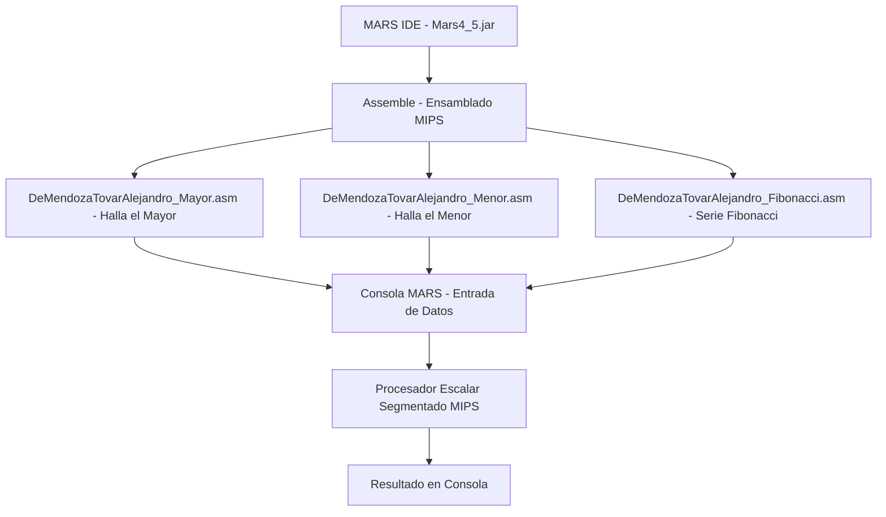

# Laboratorio 1 - Estructura de Computadores

---

Este repositorio contiene los programas en lenguaje ensamblador MIPS desarrollados en **MARS (MIPS Assembler and Runtime Simulator)** para el **Laboratorio #1: Simulación y optimización de un programa en un procesador escalar segmentado**.

## Contenido del repositorio:

- `DeMendozaTovarAlejandro_Mayor.asm` → Programa que permite ingresar entre 3 y 5 números y determina el **mayor** de ellos.  
- `DeMendozaTovarAlejandro_Menor.asm` → Programa que permite ingresar entre 3 y 5 números y determina el **menor** de ellos.  
- `DeMendozaTovarAlejandro_Fibonacci.asm` → Programa que genera una **serie Fibonacci** de longitud indicada por el usuario y calcula la suma de sus elementos.  

## Arquitectura

## Ejecución de los programas:

1. Abrir el archivo `Mars4_5.jar` en Java (MARS IDE).  
2. Cargar el script `.asm` correspondiente.  
3. Seleccionar la opción **Assemble**.  
4. Ejecutar el programa con **Go**.  
5. Ingresar los valores solicitados por consola.  

## Evidencias incluidas en el informe

Cada programa cuenta con:  
- Captura **antes de compilar**.  
- Captura **después de compilar**.  
- Captura **después de ejecutar**.
- Explicación del código.  

## Autor:

Este laboratorio fue desarrollado en el marco de la asignatura **Estructura de Computadores**.  

- ***Alejandro De Mendoza*** – [Perfil GitHub](https://github.com/AlejoTechEngineer)  

---
